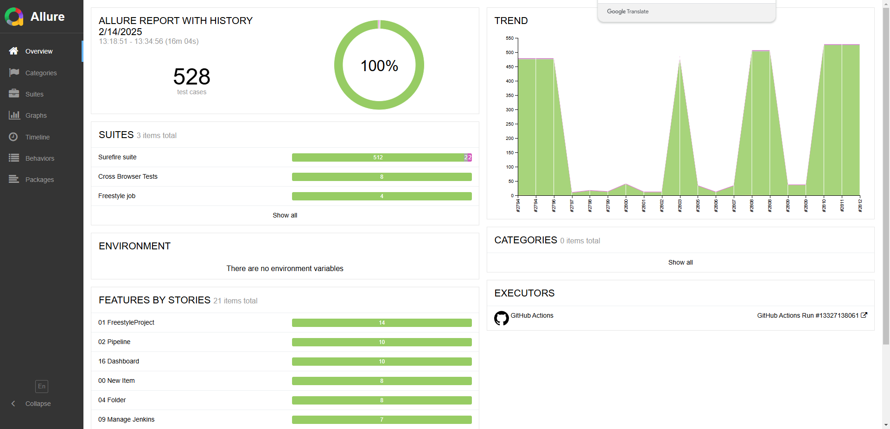

<h1 align="center">Cypress Project for Testing the CI/CD Tool Jenkins</h1>
<p align="center">
  
  
  
  
  
  
  
  
  
  
  
  
</p>

<p align="center">
  
</p>

> Jenkins is an automation tool designed for Continuous Integration (CI) and Continuous Deployment (CD). It allows automatic execution of build, testing, and deployment processes whenever code changes are made in the repository.

<p align="center">
<a href="https://valiantsin2021.github.io/Cypress-Jenkins"> Last run Allure report</a>
</p>


## Tech Stack
<p align="center">
  
</p>
<p align="center">
  
  
  
  
  
</p>

____
<a id="cases"></a>
## ️ Test documentation

- 📊 Feature Matrix - media/JavaScript Feature matrix.xlsx


**Project Structure**

This project is a complete example of a Test automation Framework using Cypress.

AUT for this project is a docker based Jenkins instance.

Automated tests include:

- Functional UI tests using Cypress native commands
- API tests - using cy-api plugin
- Performance tests - using Lighthouse and inline performance scripts
- Accessibility tests - using val-a11y plugin (modified fork of wick-a11y made by Sebastian Clavijo Suero)

Tests are executed in parallel mode. (Parallelization on GitHub Actions with cypress-split plugin)

Global cleanup is executed after each test via API calls (see commands.js file).

**Reporters**

Allure reporter with previous runs history is used to generate test reports.

To generate reports, run command ```npm run report```

Allure report is available in report/allure-report folder.

Accessibility reports are generated using val-a11y plugin.

Lighthouse reports are generated using @cypress-audit/lighthouse plugin.

CI pipeline is executed on GitHub Actions and test results are uploaded to Allure report and hosted on GitHub pages. - [Project report](https://valiantsin2021.github.io/Cypress-Jenkins/)

To clean the previous run reports use command ```npm run clean```

____
<a id="allureReport"></a>
##  Allure Report Example

<p align="center">
<a href="https://valiantsin2021.github.io/Cypress-Jenkins"> Last run Allure report</a>
</p>

<p align="center">
  
</p>

**How to start working in our project?**

**Prerequisites**

- Docker
- Node.js
- NPM
- VSCode
- Jenkins up and running

1. Clone repository to your machine.

2. Navigate to project root folder.

3. Run command ```npm run prepare``` to setup pre-commit hooks.

4. Run command ```npm install``` in terminal VScode to install dependencies.

5. Copy and paste the file ```cypress.env.json.example``` to project root folder. Сhange the file name to ```cypress.env.json```. Put provided to you by teacher credentials in json file.

6. Setup Jenkins using Docker: (to archive the jenkins_home data folder use `tar -cvf - jenkins_home | split -b 100M - jenkins_home.tar.`)

- Download and install Docker desktop (https://www.docker.com/products/docker-desktop)
- Using Git Bash for Windows or Terminal for Mac, run following 3 commands (it will update the jenkins backup with predefined settings):
  
  ```bash
   cat jenkins_data/jenkins_home.tar.0* > jenkins_backup.tar && md5sum jenkins_backup.tar
   tar -xvf ./jenkins_backup.tar
   chmod -R 777 ./jenkins_home
   ```
- Add to cypress.env.json the following credentials provided to you by teacher: ```local.admin.username```, ```local.admin.password```, ```local.admin.token```, ```local.port```, ```local.host```.
- Run command `docker run --name jekins --detach -p 8081:8080 -p 50000:50000 -v ${PWD}/jenkins_home:/var/jenkins_home jenkins/jenkins:2.462.3-lts-jdk17`
- Verify the Jenkins is running using ```http://localhost:8081```. If you see the login page of Jenkins, you can start creating your tests and run them using Cypress. 
- Use ```npx cypress open```  to run tests.

**Project Coding Convention**

Naming conventions:
We shall use Camelcase for naming conventions: ```camelCase```

Spec names:
Spec should have a name containing the name of the userstory (US): ```header.cy.js``` 


**Spec structure:**

- Each block ```describe``` should contain the name of spec file
- Each test (```it```) should contain name of test case (```TC```) 

example:
describe('Header', () => {

    it('Verify logo jenkins is visible on the header', function () {
        ...
    })

    it('Verify logo jenkins is clickable and redirects to homePage', function () {
        ...
    })
}) 

**Faker library**

The project utilises Faker.js library. You can find more info here: https://v6.fakerjs.dev/guide/
Use this import in your file: 
import { faker } from '@faker-js/faker';

**Testing library**

You can find more info here: https://testing-library.com/docs/cypress-testing-library/intro/

### Static Code Analysis, Formatting, and Pre-commit Hooks Setup

This project uses ESLint and Prettier for static code analysis and formatting, along with pre-commit hooks to ensure code quality.

**ESLint**

ESLint is configured to use the following plugins:
- `eslint-config-prettier`: Disables ESLint rules that might conflict with Prettier.
- `eslint-plugin-chai-friendly`: Lints Chai assertions.
- `eslint-plugin-cypress`: Lints Cypress tests.
- `eslint-plugin-no-only-tests`: Prevents committing `.only` tests.

You can run ESLint with the following command:
```sh
npm run lint
```

ESLint rules can be configured in `eslint.config.mjs` file

**Prettier**

Prettier is used for code formatting. It is configured to run on various file types including JavaScript, TypeScript, and JSON files.

You can format your code with the following command:
```sh
npm run format
```

Prettier rules can be configured in `.prettierrc.json` file

**Pre-commit Hooks**

Pre-commit hooks are set up using lint-staged to run ESLint and Prettier on staged files before committing. This ensures that only properly linted and formatted code is committed.

** To add hooks - copy the contents of the .hooks directory to .git/hooks

On commit the staged code will be automatically formatted and linted. Commit will not be finished if there are linting errors found.

The configuration in package.json is as follows:

```json
"lint-staged": {
  "**/*.+(cjs|js|ts|tsx)": [
    "eslint --fix"
  ],
  "**/*.+(cjs|js|ts|json)": [
    "prettier --cache --write"
  ]
}
```

**Commitlint**

Commitlint (https://commitlint.js.org/) is used to enforce conventional commit messages. It is configured to use the @commitlint/config-conventional preset. 

Rules: https://commitlint.js.org/reference/rules 

Common types according to commitlint-config-conventional can be:

- build
- chore
- ci
- docs
- feat
- fix
- perf
- refactor
- revert
- style
- test
  
These can be modified by your own configuration.

**Usage**

- Linting: ```npm run lint```
- Formatting: ```npm run format```
- Pre-commit hooks: Automatically run on git commit

**How to run Jenkins on Docker**
  
`docker run --name jenkins -p 8081:8080 -p 50000:50000 --restart=on-failure -v ${PWD}/jenkins_home:/var/jenkins_home  --user root jenkins/jenkins:2.462.3-jdk17`

Run cypress tests in docker container:

`docker run -it -v "${PWD}:/e2e" -w /e2e cypress/included:latest  --browser=chrome`

To run both services:

`docker-compose up`